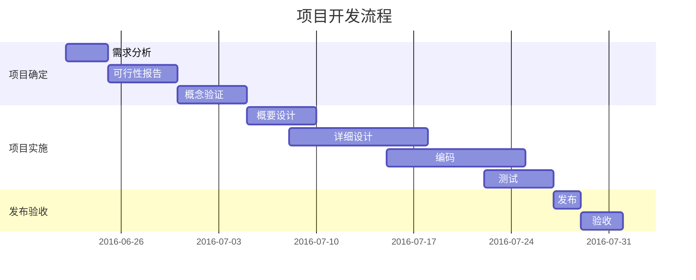
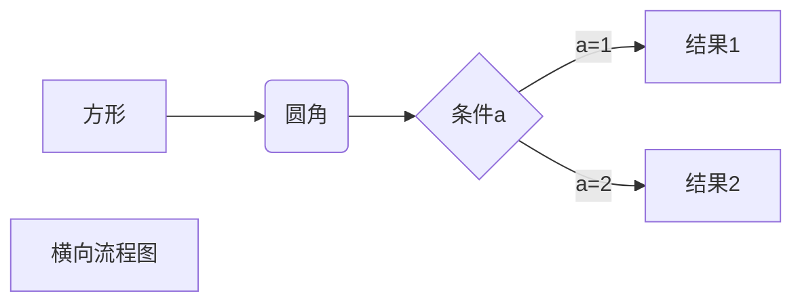

> [!Note] 参考资料：
> 
> - [markdown入门参考](https://github.com/LearnShare/Learning-Markdown/blob/master/README.md)
>     
> - [mdeditor](https://www.zybuluo.com/mdeditor) 一款国内的在线markdown编辑器
>     
> - [mditor](http://bh-lay.github.io/mditor/) 一款轻量级的markdown编辑器
>     
> - [lepture-editor](https://www.miaoroom.com/?target/aHR0cHM6Ly9naXRodWIuY29tL2xlcHR1cmUvZWRpdG9y)
>     
> - [markdown-editor](https://www.miaoroom.com/?target/aHR0cHM6Ly9naXRodWIuY29tL2pidC9tYXJrZG93bi1lZGl0b3I=)

# 一 关于Markdown

## 介绍

[Wiki: Markdown](http://zh.wikipedia.org/wiki/Markdown)

> Markdown 是一种轻量级标记语言，创始人为约翰·格鲁伯（John Gruber）。它允许人们“使用易读易写的纯文本格式编写文档，然后转换成有效的 XHTML（或者 HTML）文档”。这种语言吸收了很多在电子邮件中已有的纯文本标记的特性。

### 为什么选择 Markdown

- 它基于纯文本，方便修改和共享；
    
- 几乎可以在所有的文本编辑器中编写；
    
- 有众多编程语言的实现，以及应用的相关扩展；
    
- 在 [GitHub](https://github.com/) 等网站中有很好的应用；
    
- 很容易转换为 HTML 文档或其他格式，兼容HTML；
    
- 适合用来编写文档、记录笔记、撰写文章。
    

> '.md' 和 '.markdown' 都是被普遍支持的扩展名，不过 '.md' 更加简单和方便。

# 二 语法

## 2.1 段落与换行

- 段落的前后必须是空行：
    

> 空行指的是行内什么都没有，或者只有空白符（空格或制表符）

> 相邻两行文本，如果中间没有空行 会显示在一行中（换行符被转换为空格）

- 如果需要在段落内加入换行（`<br>`）：
    

> 可以在前一行的末尾加入至少两个空格 然后换行写其它的文字

- Markdown 中的多数区块都需要在两个空行之间。
    

## 2.2 标题

### Setext 形式

```markdown
H1  
====  
​  
H2  
----
```

> `=` 和 `-` 的数量是没有限制的。通常的做法是使其和标题文本的长度相同，这样看起来比较舒服。或者可以像我一样，用四个 `-` 或 `=`。 Setext 形式只支持 `h1` 和 `h2` 两种标题。
> 
> 使用 === 表示一级标题，使用 --- 表示二级标题。(Setext 形式只支持 `h1` 和 `h2` 两种标题。)

### atx 形式

① 可以用对称的 `#` 包括文本：

```markdown
####H4####  
​  
#####H5#####
```

② 也可以只在左边使用 `#`：

```markdown
####H4  
​  
#####H5
```

③ 成对的 `#` 左侧和只在左边使用的 `#` 的情况：左侧都不可以有任何空白，但其内侧可以使用空白。

```markdown
 ###左侧使用了空格###  
 ### 内侧使用了空格
```
​  


## 2.3 引用

### 引用内容

在段落或其他内容前使用 `>` 符号，就可以将这段内容标记为 '引用' 的内容（`<blockquote>`）

### 多行引用

> 多行引用 可以在每行前加 `>`

```
>如果仅在第一行使用 `>`，  
后面相邻的行即使省略 `>`，也会变成引用内容
```

> 如果仅在第一行使用 `>`， 后面相邻的行即使省略 `>`，也会变成引用内容

```
>如果引用内容需要换行，    
>可以在行尾添加两个空格  
>  
>或者在引用内容中加一个空行
```

> 如果引用内容需要换行， 可以在行尾添加两个空格
> 
> 或者在引用内容中加一个空行

### 嵌套引用

```
>也可以在引用中  
>>使用嵌套的引用
```

> 也可以在引用中
> 
> > 使用嵌套的引用

## 2.4 列表

### 无序列表

使用 *，+，- 表示无序列表。

### 有序列表

1. 有序列表以数字和 `.` 开始；
    
2. 数字的序列并不会影响生成的列表序列；
    
3. 但仍然推荐按照自然顺序（1.2.3...）编写。
    

### 嵌套的列表

```
1. 第一层  
  + 1-1  
  + 1-2  
2. 无序列表和有序列表可以随意相互嵌套  
  3. 2-1  
  4. 2-2
```

1. 第一层
    
    - 1-1
        
    - 1-2
        
2. 无序列表和有序列表可以随意相互嵌套
    
    1. 2-1
        
    2. 2-2
        

### 语法和用法

1. 无序列表项的开始是：符号 空格；
    
2. 有序列表项的开始是：数字 `.` 空格；
    
3. 空格至少为一个，多个空格将被解析为一个；
    
4. 如果仅需要在行前显示数字和 `.`：
    

```
05\. 可以使用：数字\. 来取消显示为列表
```

> \05. 可以使用：数字. 来取消显示为列表

## 2.5 代码

### 代码块

可以使用缩进来插入代码块这里使用``````来包含多行代码：

代码块前后需要有至少一个空行，且每行代码前需要有至少一个 Tab 或四个空格；

```html
<html> // Tab开头  
    <title>Markdown</title>  
</html> // 四个空格开头
```

### 行内代码

也可以通过 ` `， 插入行内代码，例如：
```html
<title>Markdown</title>
```

### 转换规则

代码块中的文本（包括 Markdown 语法）都会显示为原始内容，而特殊字符会被转换为 HTML [字符实体](https://zh.wikipedia.org/wiki/XML%E4%B8%8EHTML%E5%AD%97%E7%AC%A6%E5%AE%9E%E4%BD%93%E5%BC%95%E7%94%A8%E5%88%97%E8%A1%A8)。

## 2.6 分隔线

- 可以在一行中使用三个或更多的 `*`、`-` 或 `_` 来添加分隔线（`<hr>`）
    
- 多个字符之间可以有空格（空白符），但不能有其他字符
    

```markdown
***  
-- -- --  
___
```


---

---

---

## 2.7 超链接

### 行内式

格式为 `[link text](URL 'title text')`。

① 普通链接：

```markdown
[Google](http://www.google.com/)
```

[Google](http://www.google.com/)

② 指向本地文件的链接：

```markdown
[icon.png](./images/icon.png)
```

[icon.png](images/icon.png)

③ 包含 'title' 的链接:

```markdown
[Google](http://www.google.com/ "Google")
```

[Google](http://www.google.com/)

> title 使用 ' 或 " 都是可以的。

### 参考式

参考式链接的写法相当于行内式拆分成两部分，并通过一个 _识别符_ 来连接两部分。参考式能尽量保持文章结构的简单，也方便统一管理 URL。

> 参考式相对于行内式有一个明显的优点，就是可以在多个不同的位置引用同一个 URL。

① 首先，定义链接：

```markdown
[Google][link]
```

[Google](http://www.google.com/)

第二个方括号内为链接独有的 _识别符_，可以是字母、数字、空白或标点符号。识别符是 _不区分大小写_ 的；

② 然后定义链接内容：

```markdown
[link]: http://www.google.com/ "Google"
```

其格式为：`[识别符]: URL 'title'`。

> 其中，URL可以使用 <> 包括起来，title 可以使用 ""、''、() 包括（考虑到兼容性，建议使用引号），title 部分也可以换行来写；
> 
> 链接内容的定义可以放在同一个文件的 _任意位置_；

③ 也可以省略 _识别符_，使用链接文本作为 _识别符_：

```markdown
[Google][]  
[Google]: http://www.google.com/ "Google"
```

[Google](http://www.google.com/)

### 自动链接

使用 `<>` 包括的 URL 或邮箱地址会被自动转换为超链接：

```markdown
<http://www.google.com/>  
​  
<123@email.com>
```

[http://www.google.com/](http://www.google.com/)

[123@email.com](mailto:123@email.com)

该方式适合行内较短的链接，会使用 URL 作为链接文字。邮箱地址会自动编码，以逃避抓取机器人。

## 2.8 图像

插入图片的语法和插入超链接的语法基本一致，只是在最前面多一个 `!`。也分为行内式和参考式两种。

### 行内式

```markdown

```

方括号中的部分是图片的替代文本，括号中的 'title' 部分和链接一样，是可选的。

### 参考式
```markdown
![GitHub][github]  
​  
[github]: https://avatars2.githubusercontent.com/u/3265208?v=3&s=100 "GitHub,Social Coding"
```

### 指定图片的显示大小

Markdown 不支持指定图片的显示大小，不过可以通过直接插入``标签来指定相关属性：

```HTML

```

## 2.9 强调

- 使用 `* *` 或 `_ _` 包括的文本会被转换为 `<em></em>` ，通常表现为斜体：
    

```markdown
这是用来 *演示* 的 _文本_
```

这是用来 _演示_ 的 _文本_

- 使用 `** **` 或 `__ __` 包括的文本会被转换为 `<strong></strong>`，通常表现为加粗：
    

```markdown
这是用来 **演示** 的 __文本__
```

这是用来 **演示** 的 **文本**

- 用来包括文本的 `*` 或 `_` 内侧不能有空白，否则 `*` 和 `_` 将不会被转换（不同的实现会有不同的表现）
    
- 如果需要在文本中显示成对的 `*` 或 `_`，可以在符号前加入 `\` 即可
    
- `*`、`**`、`_` 和 `__` 都必须 _成对使用_ 。
    

## 2.10 字符转义

反斜线（`\`）用于插入在 Markdown 语法中有特殊作用的字符

这些字符包括：

  \ `* _ {}[]()#+. !

# 三 扩展语法

## 3.1 内容目录

在段落中填写 `[TOC]` 以显示全文内容的目录结构。


## 3.2 标签分类

在编辑区任意行的列首位置输入以下代码给文稿标签：

```markdown
标签： 数学 英语 Markdown  
​  
或者  
​  
Tags： 数学 英语 Markdown
```

## 3.3 删除线

成对使用 ~~ 表示删除线。

```markdown
~~这是一段错误的文本。~~
```

## 3.4 注脚

使用 `[^keyword]` 表示注脚。

这是一个注脚[^footnote]的样例。

这是第二个注脚[^footnote2]的样例。

[footnote]  1

[footnote2]  2

## 3.5 LaTeX 公式

$ 表示行内公式：

质能守恒方程可以用一个很简洁的方程式 $E=mc^2$ 来表达。

```markdown
$$ 表示整行公式：

$$\sum_{i=1}^n a_i=0$$

$$f(x_1,x_x,\ldots,x_n) = x_1^2 + x_2^2 + \cdots + x_n^2 $$

$$\sum^{j-1}_{k=0}{\widehat{\gamma}_{kj} z_k}$$
```

访问 [MathJax](http://meta.math.stackexchange.com/questions/5020/mathjax-basic-tutorial-and-quick-reference) 参考更多使用方法。

## 3.6 加强的代码块

支持四十一种编程语言的语法高亮的显示，行号显示。格式如下：

```python  
@requires_authorization  
def somef  
.......................  
```

非代码示例：

```
$ sudo apt-get install vim-gnome
```

Python 示例：

```Python
@requires_authorization  
def somefunc(param1='', param2=0):  
    '''A docstring'''  
    if param1 > param2: # interesting  
        print 'Greater'  
    return (param2 - param1 + 1) or None  
​  
class SomeClass:  
    pass  
​  
>>> message = '''interpreter  
... prompt'''
```

JavaScript 示例：

```JavaScript
/**  
* nth element in the fibonacci series.  
* @param n >= 0  
* @return the nth element, >= 0.  
*/  
function fib(n) {  
  var a = 1, b = 1;  
  var tmp;  
  while (--n >= 0) {  
    tmp = a;  
    a += b;  
    b = tmp;  
  }  
  return a;  
}  
​  
document.write(fib(10));
```

## 3.7 表格支持

### 单元格和表头

使用 `|` 来分隔不同的单元格，使用 `-` 来分隔表头和其他行：

```markdown
| name       | age |
| ---------- | --- |
| LearnShare | 12  |
| Mike       | 32  |
```

|name|age|
|---|---|
|LearnShare|12|
|Mike|32|

为了美观，可以使用空格对齐不同行的单元格，并在左右两侧都使用 `|` 来标记单元格边界：

```markdown
|    name    | age |  
| ---------- | --- |  
| LearnShare |  12 |  
| Mike       |  32 |
```

|name|age|
|---|---|
|LearnShare|12|
|Mike|32|

> 为了使 Markdown 更清晰，`|` 和 `-` 两侧需要至少有一个空格（最左侧和最右侧的 `|` 外就不需要了）。

### 对齐

在表头下方的分隔线标记中加入 `:`，即可标记下方单元格内容的对齐方式：

- `:---` 代表左对齐
    
- `:--:` 代表居中对齐
    
- `---:` 代表右对齐
    

```markdown
| left | center | right |     |
| :--- | :----: | ----: | --- |
| aaaa | bbbbbb | ccccc |     |
| a    | b      | c     |     |
|      |        |       |     |
```

|left|center|right|
|---|---|---|
|aaaa|bbbbbb|ccccc|
|a|b|c|

> 如果不使用对齐标记，单元格中的内容默认左对齐；表头单元格中的内容会一直居中对齐（不同的实现可能会有不同表现）。

### 插入其他内容

表格中可以插入其他 Markdown 中的行内标记：

```markdown
|     name     | age |             blog                |     |
| ------------ | --- | ------------------------------- | --- |
| _LearnShare_ | 12  | [LearnShare](http://xianbai.me) |     |
| __Mike__     | 32  | [Mike](http://mike.me)          |     |
```

|name|age|blog|
|---|---|---|
|_LearnShare_|12|[LearnShare](http://xianbai.me/)|
|**Mike**|32|[Mike](http://mike.me/)|

## 3.8 Html 标签

本站支持在 Markdown 语法中嵌套 Html 标签，譬如，你可以用 Html 写一个纵跨两行的表格：

```html
<table>  
    <tr>  
        <th rowspan="2">值班人员</th>  
        <th>星期一</th>  
        <th>星期二</th>  
        <th>星期三</th>  
    </tr>  
    <tr>  
        <td>李强</td>  
        <td>张明</td>  
        <td>王平</td>  
    </tr>  
</table>
```

​

|值班人员|星期一|星期二|星期三|
|---|---|---|---|
|李强|张明|王平|

​

## 3.9 内嵌图标

本站的图标系统对外开放，在文档中输入

```html
<i class="icon-weibo"></i>
```

即显示微博的图标： <i class="icon-weibo icon-2x"></i>

替换 上述 `i 标签` 内的 `icon-weibo` 以显示不同的图标，例如：

```html
<i class="icon-renren"></i>
```

即显示人人的图标： 

```html
<i class="icon-renren icon-2x"></i>
```

更多的图标和玩法可以参看 [font-awesome](http://fortawesome.github.io/Font-Awesome/3.2.1/icons/) 官方网站。

## 3.10 待办事宜 Todo 列表

使用带有 [ ] 或 [x] （未完成或已完成）项的列表语法撰写一个待办事宜列表，并且支持子列表嵌套以及混用Markdown语法，例如：

```
- [ ] **Cmd Markdown 开发**  
    - [ ] 改进 Cmd 渲染算法，使用局部渲染技术提高渲染效率  
    - [ ] 支持以 PDF 格式导出文稿  
    - [x] 新增Todo列表功能 [语法参考](https://github.com/blog/1375-task-lists-in-gfm-issues-pulls-comments)  
    - [x] 改进 LaTex 功能  
        - [x] 修复 LaTex 公式渲染问题  
        - [x] 新增 LaTex 公式编号功能 [语法参考](http://docs.mathjax.org/en/latest/tex.html#tex-eq-numbers)  
- [ ] **七月旅行准备**  
    - [ ] 准备邮轮上需要携带的物品  
    - [ ] 浏览日本免税店的物品  
    - [x] 购买蓝宝石公主号七月一日的船票
```

对应显示如下待办事宜 Todo 列表：

- [x]  **Cmd Markdown 开发**
    - [x]  改进 Cmd 渲染算法，使用局部渲染技术提高渲染效率
    - [ ]  支持以 PDF 格式导出文稿
    - [ ]  新增Todo列表功能 [语法参考](https://github.com/blog/1375-task-lists-in-gfm-issues-pulls-comments)
    - [ ]  改进 LaTex 功能
        - [x]  修复 LaTex 公式渲染问题
        - [x]  新增 LaTex 公式编号功能 [语法参考](http://docs.mathjax.org/en/latest/tex.html#tex-eq-numbers)
- [ ]  **七月旅行准备**
    - [ ]  准备邮轮上需要携带的物品
    - [ ]  浏览日本免税店的物品
    - [x]  购买蓝宝石公主号七月一日的船票

## 3.11 流程图

### 示例1

```flow  
st=>start: Start:>https://www.zybuluo.com  
io=>inputoutput: verification  
op=>operation: Your Operation  
cond=>condition: Yes or No?  
sub=>subroutine: Your Subroutine  
e=>end  
​  
st->io->op->cond  
cond(yes)->e  
cond(no)->sub->io  
```


## 3.12 序列图

### 示例 1

```squence  
```squence
对象A->对象B: 对象B你好吗?（请求）  
Note right of 对象B: 对象B的描述  
Note left of 对象A: 对象A的描述(提示)  
对象B-->对象A: 我很好(响应)  
对象A->对象B: 你真的好吗？  

```

### 示例 2

```squence  
```squence  
Alice->Bob: Hello Bob, how are you?  
Note right of Bob: Bob thinks  
Bob-->Alice: I am good thanks!  
```


### 示例 3

```squence  
```squence  
Title: Here is a title  
A->B: Normal line  
B-->C: Dashed line  
C->>D: Open arrow  
D-->>A: Dashed open arrow  
```


## 3.13 甘特图

甘特图内在思想简单。基本是一条线条图，横轴表示时间，纵轴表示活动（项目），线条表示在整个期间上计划和实际的活动完成情况。它直观地表明任务计划在什么时候进行，及实际进展与计划要求的对比。



```
~~~mermaid
gantt
    title 项目开发流程
    section 项目确定
        需求分析       :a1, 2016-06-22, 3d
        可行性报告     :after a1, 5d
        概念验证       : 5d
    section 项目实施
        概要设计      :2016-07-05  , 5d
        详细设计      :2016-07-08, 10d
        编码          :2016-07-15, 10d
        测试          :2016-07-22, 5d
    section 发布验收
        发布: 2d
        验收: 3d
```

## 3.14 Mermaid 流程图



